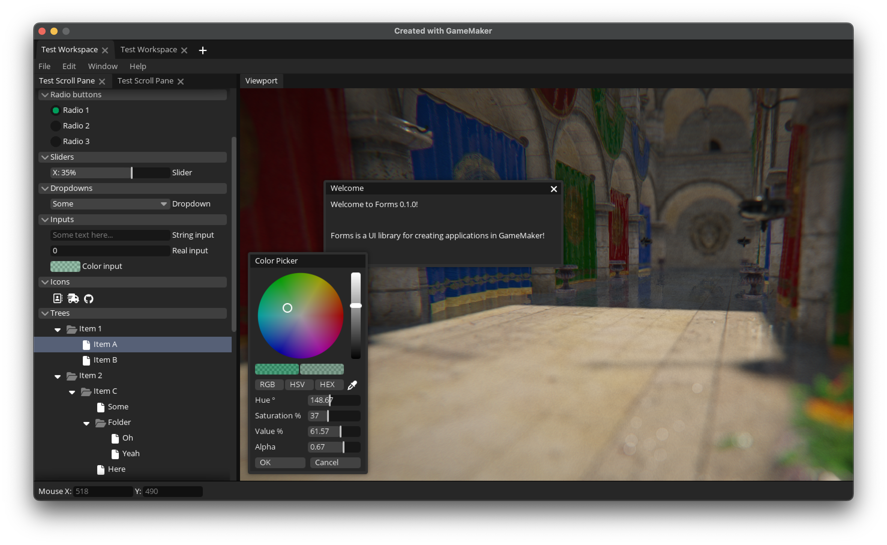

# Forms

> UI library for creating desktop applications in GameMaker

## Status: Community Project 💙

This is a community-developed project, released under **CC0 1.0 Universal (Public Domain)**. It is **no longer actively maintained** by the original author. Feel free to fork, modify, or experiment.

## About

Forms is a UI library for creating applications in GameMaker. Its origins trace back to [PushEd for GameMaker: Studio 1.4](https://github.com/GameMakerDiscord/PushEd), and after several years, it evolved into the system used in [BBMOD GUI](https://blueburn.cz/index.php?menu=bbmod_gui), with significant modifications. The version of Forms you see here is a complete rewrite, built on the foundations of its predecessors, but now leveraging modern GML features.

## Screenshots

